内容整理自[《Java并发编程实战》](https://time.geekbang.org/column/intro/159)[《java-concurrency-patterns》](https://github.com/LeonardoZ/java-concurrency-patterns)
相关工具类[《vjtools》](https://github.com/vipshop/vjtools)

 [](https://travis-ci.org/Fadezed/concurrency)


<div align="center">  

 

</div><br>

# 1.序言及全览
## 学习并发的原因
* 硬件驱动
* 人才稀缺


## 并发编程解决的核心问题
* 分工（如何高效地拆解任务并分配给线程）Fork/Join 框架
* 同步（指的是线程之间如何协作）CountDownLatch
* 互斥（保证同一时刻只允许一个线程访问共享资源）可重入锁

## 如何学习
* 跳出来，看全景，站在模型角度看问题（避免盲人摸象）
例如：synchronized、wait()、notify()不过是操作系统领域里管程模型的一种实现而已
* 钻进去，看本质
* 探究 Doug Lea 大师在J.U.C 包创造的章法
* 知识体系全景图


-------

# 2.抽象问题总结
## 并发程序的背后
1. CPU 增加了缓存，以均衡与内存的速度差异；
2. 操作系统增加了进程、线程，以分时复用 CPU，进而均衡 CPU 与 I/O 设备的速度差异；
3. 编译程序优化指令执行次序，使得缓存能够得到更加合理地利用。


## 缓存导致的可见性问题
* 一个线程对共享变量的修改，另外一个线程能够立刻看到，我们称为**可见性**
* [代码示例](https://github.com/Fadezed/concurrency/blob/master/src/main/java/com/example/concurrency/features/visibility/Visibility.java)

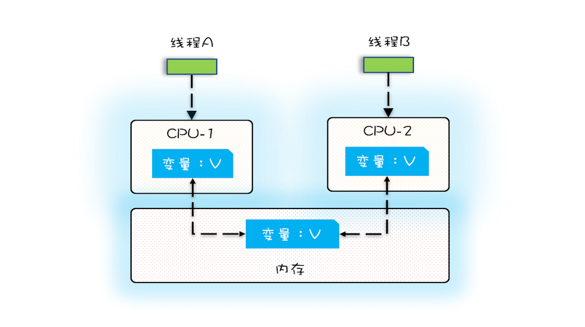


## 线程切换带来的原子性问题
* 一个或者多个操作在 CPU 执行的过程中不被中断的特性称为**原子性**
* **时间片**概念
* 线程切换 ---〉提升cpu利用率。  tips:Unix系统因支持多进程分时复用而出名。
* 线程切换[代码示例](https://github.com/Fadezed/concurrency/blob/master/src/main/java/com/example/concurrency/features/contentswitch/ContentSwitchTest.java)。
* 原子问题[代码示例](https://github.com/Fadezed/concurrency/blob/master/src/main/java/com/example/concurrency/features/atomic/AtomicCounter.java)

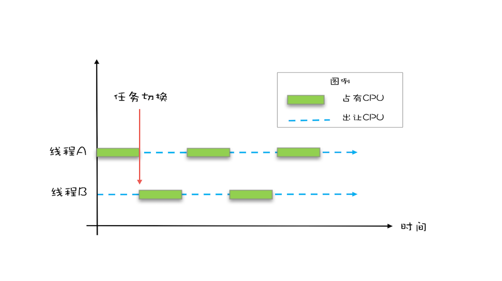
* count+=1 操作分析
    * 指令 1：需要把变量 count 从内存加载到 CPU的寄存器；
    * 指令 2：在寄存器中执行 +1 操作；
    * 指令 3：将结果写入内存（缓存机制导致可能写入的是 CPU 缓存而不是内存）。
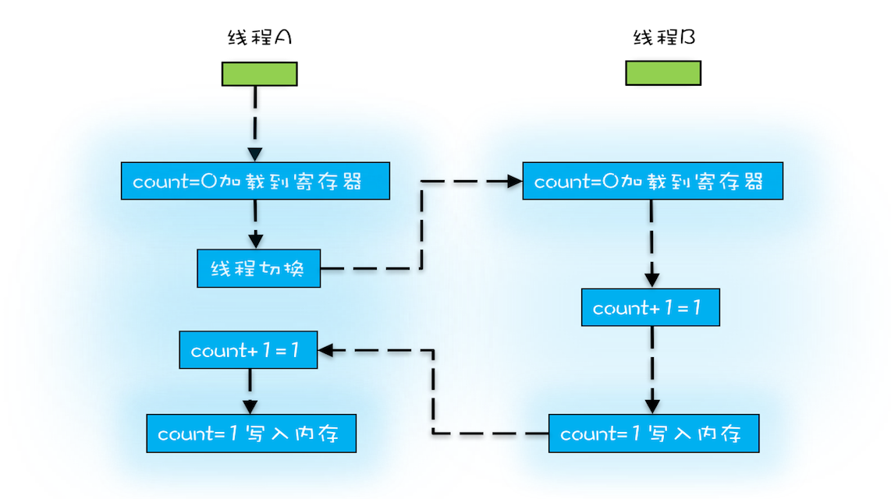


## 编译优化带来的有序性问题

* 双重检查创建单例对象


```
public class Singleton {
  private static Singleton instance;
  private Singleton(){}
  public static Singleton getInstance(){
    //一重判断
    if (instance == null) {
      synchronized(Singleton.class) {
        //二重判断防止多线程同时竞争锁的情况多次创建
        if (instance == null)
          instance = new Singleton();
        }
    }
    return instance;
  }
}
```
* new 操作的顺序问题
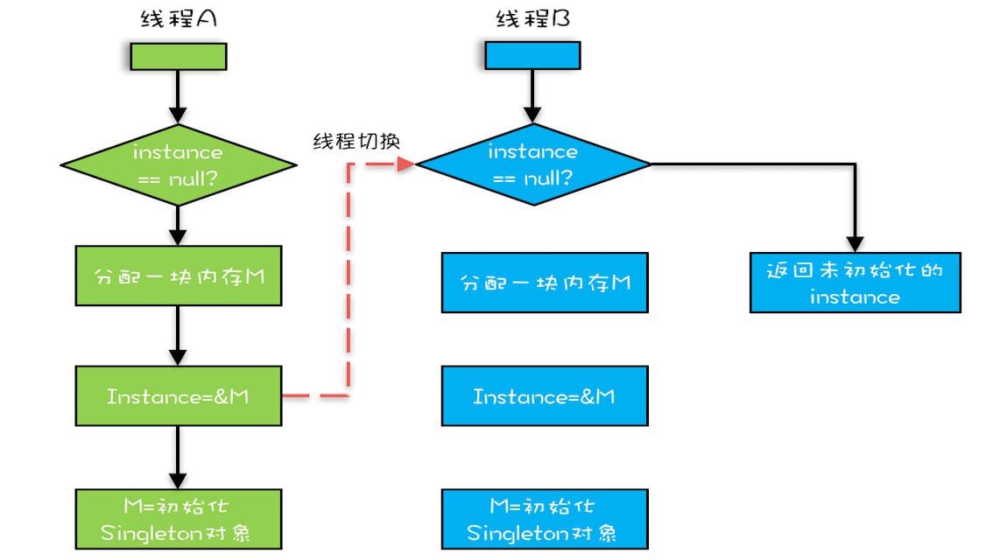


-------
# 3.JAVA内存模型
## 按需禁用缓存以及编译优化 [代码来源](http://www.cs.umd.edu/~pugh/java/memoryModel/jsr-133-faq.html)

* ## volatile
    * [代码示例](https://github.com/Fadezed/concurrency/blob/master/src/main/java/com/example/concurrency/features/volatilecase/VolatileExample.java)

* ## synchronized
    
    * JVM 中的同步是基于进入和退出管程（Monitor）对象实现的。每个对象实例都会有一个 Monitor，Monitor 可以和对象一起创建、销毁。Monitor 是由 ObjectMonitor 实现，而 ObjectMonitor 实现，而 ObjectMonitor 是由C++ 的 ObjectMonitor.hpp 文件实现

         `当多个线程同时访问时，多个线程会被先放在EntryList集合，处于block状态的线程，都会被加入到该列表。接下来当线程获取到对象的Monitor时，Monitor依靠底层操作系统的Mutex Lock来实现互斥，线程申请Mutex成功则持有，其它线程无法获取到Mutex`
    ```
    ObjectMonitor() {
       _header = NULL;
       _count = 0; // 记录个数
       _waiters = 0,
       _recursions = 0;
       _object = NULL;
       _owner = NULL;
       _WaitSet = NULL; // 处于 wait 状态的线程，会被加入到 _WaitSet
       _WaitSetLock = 0 ;
       _Responsible = NULL ;
       _succ = NULL ;
       _cxq = NULL ;
       FreeNext = NULL ;
       _EntryList = NULL ; // 处于等待锁 block 状态的线程，会被加入到该列表
       _SpinFreq = 0 ;
       _SpinClock = 0 ;
       OwnerIsThread = 0 ;
    }
    ```

    *  wait():如果线程调用 wait() 方法，就会释放当前持有的 Mutex，并且该线程会进入 WaitSet 集合中，等待下一次被唤醒。如果当前线程顺利执行完方法，也将释放 Mutex。
       

    * 锁升级优化
        * jdk1.6引入Java对象头（MarkWord、指向类的指针以及数组长度三部分组成）
           
            `对象实例分为对象头、实例数据和对齐填充`
        *  64位JVM中MarkWord的存储结构
            
        * 偏向锁
        * 轻量级锁
        * 重量级锁
    
    
   * [代码示例](https://github.com/Fadezed/concurrency/blob/master/src/main/java/com/example/concurrency/features/synchronizedcase/SynchronizedExample.java)
    
    ```
    class X {
      // 修饰非静态方法 锁对象为当前类的实例对象 this
      synchronized void get() {
      }
      // 修饰静态方法 锁对象为当前类的Class对象 Class X
      synchronized static void set() {
      }
      // 修饰代码块
      Object obj = new Object()；
      void put() {
        synchronized(obj) {
        }
      }
    }  
    
    ```
    
## final

*  [代码示例](https://github.com/Fadezed/concurrency/blob/master/src/main/java/com/example/concurrency/features/finalcase/FinalExample.java)
    * 修饰变量时，初衷是告诉编译器：这个变量生而不变，非immutable，即只能表示对象引用不能被赋值（例如List）；
    *  修饰方法则方法不能被重写
    *  修饰类则不能被扩展继承。

    
  
```
    final int x;
    // 错误的构造函数
    public FinalFieldExample() { 
          x = 3;
          y = 4;
          // 此处就是讲 this 逸出，
          global.obj = this;
    }

        
```

* ## Happens-Before六大规则
    1. **程序的顺序性规则**
    
     `程序前面对某个变量的修改一定是对后续操作可见的。`
    
    2. **volatile 变量规则**
    
     `对一个 volatile 变量的写操作， Happens-Before 于后续对这个 volatile 变量的读操作。`
    
    3. **传递性规则**
    `A Happens-Before B，且 B Happens-Before C，那么A Happens-Before C。`
    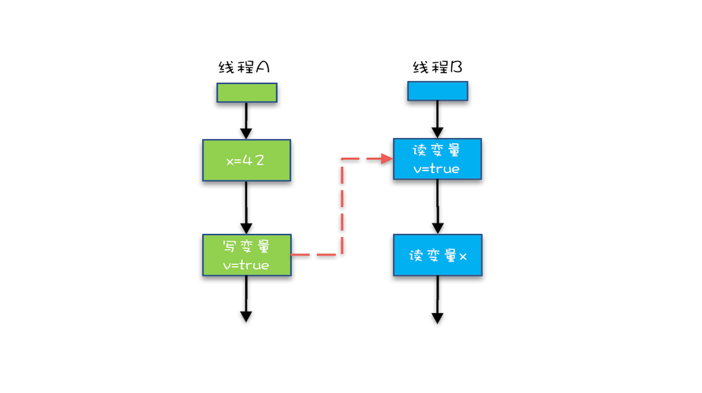  
    
    4. **管程（synchronized）中锁的规则**
        `对一个锁的解锁 Happens-Before 于后续对这个锁加锁`
        ```
        synchronized (this) { // 此处自动加锁
              // x 是共享变量, 初始值 =10
              if (this.x < 12) {
                this.x = 12; 
              }  
            } // 此处自动解锁
            
        ```

    5. **线程 start() 规则**
        `主线程 A 启动子线程 B 后，子线程 B 能够看到主线程在启动子线程 B 前的操作。`
        ```
        Thread B = new Thread(()->{
          // 主线程调用 B.start() 之前
          // 所有对共享变量的修改，此处皆可见
          // 此例中，var==77
        });
        // 此处主线程A对共享变量 var 修改
        var = 77;
        // 主线程启动子线程
        B.start();

        ```
    6. **线程 join() 规则**
        `主线程 A 等待子线程 B 完成（主线程 A 通过调用子线程B 的 join() 方法实现），当子线程 B 完成后（主线程 A 中 join() 方法返回），主线程能够看到子线程的操作。`
  
        ```
        Thread B = new Thread(()->{
          // 此处对共享变量 var 修改
          var = 66;
        });
        // 例如此处对共享变量修改，
        // 则这个修改结果对线程 B 可见
        // 主线程启动子线程
        B.start();
        B.join()
        // 子线程所有对共享变量的修改
        // 在主线程调用 B.join() 之后皆可见
        // 此例中，var==66

        ```
           
-------
# 4.JAVA线程的生命周期 
* [代码示例](https://github.com/Fadezed/concurrency/blob/master/src/main/java/com/example/concurrency/features/threadstate/ThreadState.java)

## 通用的线程生命周期
* 初始状态

    `指的是线程已经被创建，但是还不允许分配 CPU 执行。这个状态属于编程语言特有的，不过这里所谓的被创建，仅仅是在编程语言层面被创建，而在操作系统层面，真正的线程还没有创建。`
* 可运行状态
    `指的是线程可以分配 CPU 执行。在这种状态下，真正的操作系统线程已经被成功创建了，所以可以分配 CPU 执行。`
* 运行状态
    `当有空闲的 CPU 时，操作系统会将其分配给一个处于可运行状态的线程，被分配到 CPU 的线程的状态就转换成了运行状态。`
* 休眠状态
    `运行状态的线程如果调用一个阻塞的 API（例如以阻塞方式读文件）或者等待某个事件（例如条件变量），那么线程的状态就会转换到休眠状态，同时释放 CPU 使用权，休眠状态的线程永远没有机会获得 CPU 使用权。当等待的事件出现了，线程就会从休眠状态转换到可运行状态。`
* 终止状态
    `线程执行完或者出现异常就会进入终止状态，终止状态的线程不会切换到其他任何状态，进入终止状态也就意味着线程的生命周期结束了。`


## Java 中线程的生命周期

* NEW（初始化状态） 
* RUNNABLE（可运行 / 运行状态)
* BLOCKED（阻塞状态）
* WAITING（无时限等待）
* TIMED_WAITING（有时限等待） 
* TERMINATED（终止状态）


### 线程转换条件
1. RUNNABLE - BLOCKED 
    * 线程等待synchronized隐式锁（线程调用阻塞式API依然是RUNNABLE状态）
2. RUNNABLE - WAITING
    * 获得synchronized隐式锁的线程，调用Object.wait();
    * Thread.join();
    * LockSupport.park();
3. RUNNABLE - TIMED_WAITING
    * Thread.sleep(long millis)
    * 获得 synchronized 隐式锁的线程调用 Object.wait(long timeout)
    * Thread.join(long millis)
    * LockSupport.parkNanos(Object blocker, long deadline)
    * LockSupport.parkUntil(long deadline)
4. NEW - RUNNABLE
    * Thread.start()
5. RUNNABLE - TERMINATED
    * run()执行完后自动转为 TERMINATED
    * stop()(@Deprecated 直接结束线程，如果线程持有ReentrantLock锁并不会释放)
    * interrupt()
        * 异常通知
        * 主动监测

-------
# 5.多线程以及线程数确定
## 多线程目的
* 降低**延迟**（发出请求到收到响应这个过程的时间；延迟越短，意味着程序执行得越快，性能也就越好。）
* 提高**吞吐量**（指的是在单位时间内能处理请求的数量；吞吐量越大，意味着程序能处理的请求越多，性能也就越好。）

## 多线程应用场景
* 优化算法
* 发挥硬件性能（CPU、IO）

### 多线程效果
* 单线程CPU和IO的利用率为50%
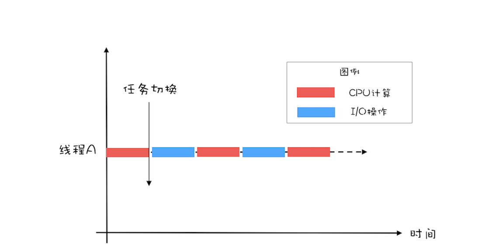
* 两个线程CPU和IO的利用率达到100%
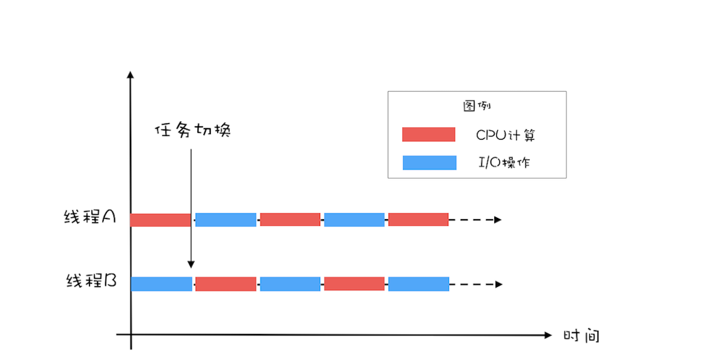

## 线程数
* CPU 计算和 I/O 操作的耗时是 1:2
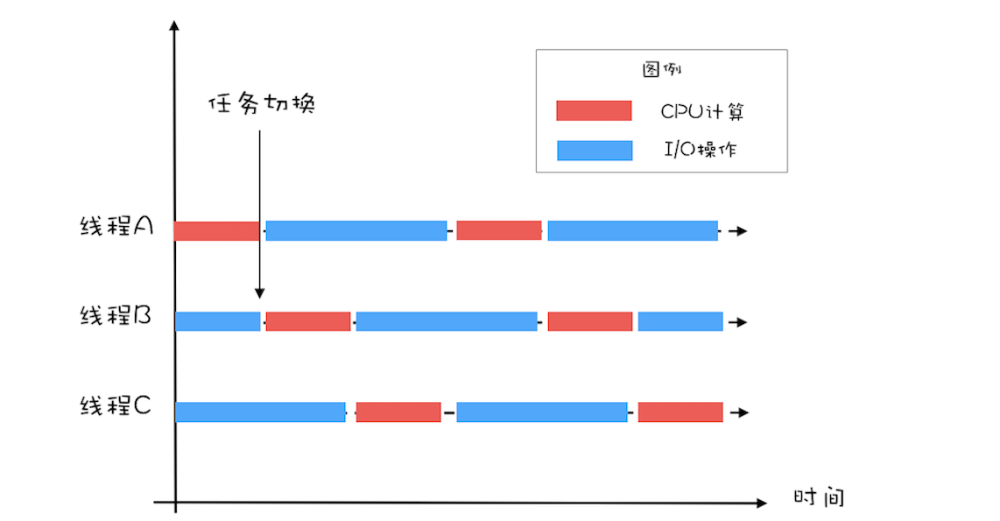
* 公式：
    * 单核CPU ：最佳线程数 =1 +（I/O 耗时 / CPU 耗时）
    * 多核CPU ：最佳线程数 =CPU 核数 * [ 1 +（I/O 耗时 / CPU 耗时）

-------
#6. 若干反例


```
class SafeCalc {
  long value = 0L;
  long get() {
    synchronized (new Object()) {
      return value;
    }
  }
  void addOne() {
    synchronized (new Object()) {
      value += 1;
    }
  }
}

```

```
class Account {
  // 账户余额  
  private Integer balance;
  // 账户密码
  private String password;
  // 取款
  void withdraw(Integer amt) {
    synchronized(balance) {
      if (this.balance > amt){
        this.balance -= amt;
      }
    }
  } 
  // 更改密码
  void updatePassword(String pw){
    synchronized(password) {
      this.password = pw;
    }
  } 
}

```


```
void addIfNotExist(Vector v, 
    Object o){
  if(!v.contains(o)) {
    v.add(o);
  }
}

```

-------
# 7. Lock和Condition
## 重复造轮子的原因抑或Lock&Condition的优势
* 能够响应中断

```
synchronized 的问题是，持有锁 A 后，如果尝试获取锁 B 失败，那么线程就进入阻塞状态，一旦发生死锁，就没有任何机会来唤醒阻塞的线程。但如果阻塞状态的线程能够响应中断信号的时候，能够唤醒它，那它就有机会释放曾经持有的锁 A。这样就破坏了不可抢占条件了。
```
* 支持超时

```
如果线程在一段时间之内没有获取到锁，不是进入阻塞状态，而是返回一个错误，那这个线程也有机会释放曾经持有的锁。这样也能破坏不可抢占条件。
```
* 非阻塞地获取锁

```
如果尝试获取锁失败，并不进入阻塞状态，而是直接返回，那这个线程也有机会释放曾经持有的锁。这样也能破坏不可抢占条件。
```
### 体现在具体代码上就是Lock接口的三个方法
```
// 支持中断的 API
void lockInterruptibly() throws InterruptedException;
// 支持超时的 API
boolean tryLock(long time, TimeUnit unit) throws InterruptedException;
// 支持非阻塞获取锁的 API
boolean tryLock();

```
### 可重入锁（ReentrantLock）
* 当线程 T1 执行到 ① 处时，已经获取到了锁 rtl ，当在 ① 处调用 get() 方法时，会在 ② 再次对锁rtl 执行加锁操作。此时，如果锁 rtl 是可重入的，那么线程 T1 可以再次加锁成功；如果锁 rtl 是不可重入的，那么线程 T1 此时会被阻塞。

```
class X {
  private final Lock rtl =new ReentrantLock();
  int value;
  public int get() {
    // 获取锁
    rtl.lock();         ②
    try {
      return value;
    } finally {
      // 保证锁能释放
      rtl.unlock();
    }
  }
  public void addOne() {
    // 获取锁
    rtl.lock();  
    try {
      value = 1 + get(); ①
    } finally {
      // 保证锁能释放
      rtl.unlock();
    }
  }
}

```
### 公平锁和非公平锁
* 指线程在等待队列中被唤醒的策略，如果是公平锁，则按照等待时间排序，优先唤醒时间长的

```
// 无参构造函数：默认非公平锁
public ReentrantLock() {
    sync = new NonfairSync();
}
// 根据公平策略参数创建锁
public ReentrantLock(boolean fair){
    sync = fair ? new FairSync() : new NonfairSync();
}
```
### 用锁的最佳实践（from Doug Lea）
* 永远只在更新对象的成员变量时加锁
* 永远只在访问可变的成员变量时加锁
* 永远不在调用其他对象的方法时加锁


-------
# 8.Semaphore
### 信号量模型
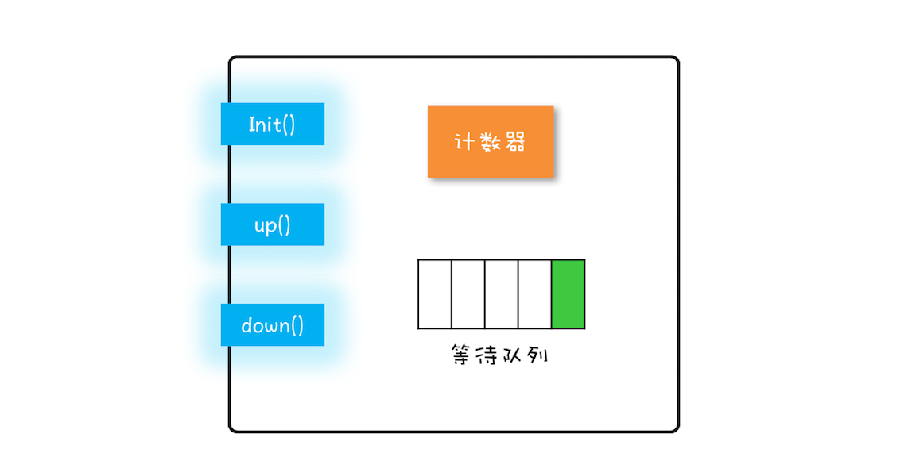
### 方法语义
* init():设置计数器的初始值。
* down():计数器的值减 1；如果此时计数器的值小于 0，则当前线程将被阻塞，否则当前线程可以继续执行。(acquire())
* up():计数器的值加 1；如果此时计数器的值小于或者等于0，则唤醒等待队列中的一个线程，并将其从等待队列中移除。(release())


```
class Semaphore{
  // 计数器
  int count;
  // 等待队列
  Queue queue;
  // 初始化操作
  Semaphore(int c){
    this.count=c;
  }
  // 
  void down(){
    this.count--;
    if(this.count<0){
      // 将当前线程插入等待队列
      // 阻塞当前线程
    }
  }
  void up(){
    this.count++;
    if(this.count<=0) {
      // 移除等待队列中的某个线程 T
      // 唤醒线程 T
    }
  }
}

```

### 使用方法
#### 实现互斥
#### 实现限流器（Semaphore 可以允许多个线程访问一个临界区）
* [代码示例](https://github.com/Fadezed/concurrency/blob/master/src/main/java/com/example/concurrency/features/semaphore/SemaphoreEx.java)


-------
# 9.ReadWriteLock、StampedLock、CountDownLatch、CyclicBarrier

## ReadWriteLock 读写锁
* 允许多个线程同时读共享变量
* 只允许一个线程写共享变量
* 如果一个写线程正在执行写操作，此时禁止读线程读共享变量

* [代码示例](https://github.com/Fadezed/concurrency/blob/master/src/main/java/com/example/concurrency/features/readwritelock/CacheByReadWriteLock.java)

## StampedLock 加上乐观读（无锁）
* [代码示例](https://github.com/Fadezed/concurrency/blob/master/src/main/java/com/example/concurrency/features/readwritelock/StampedLockEx.java)

## CountDownLatch
* [代码示例](https://github.com/Fadezed/concurrency/blob/master/src/main/java/com/example/concurrency/features/countdownlatch/CountDownLatchEx.java)

##  CyclicBarrier
* [代码示例](https://github.com/Fadezed/concurrency/blob/master/src/main/java/com/example/concurrency/features/cyclicbarrier/CyclicBarrierEx.java)

   

-------
# 10. 并发容器
## 同步容器（jdk1.5 之前）
### 包装安全类
* List list = Collections.synchronizedList(new ArrayList());
* Set set = Collections.synchronizedSet(new HashSet());
* Map map = Collections.synchronizedMap(new HashMap());

### Vector、Stack 和 Hashtable（基于synchronized实现）

### 对同步容器做遍历操作时需要加锁保证互斥
* 如下组合操作非原子操作，故通过synchronized保证原子操作

```
List list = Collections.synchronizedList(new ArrayList());
synchronized (list) {  
  Iterator i = list.iterator(); 
  while (i.hasNext())
    foo(i.next());
}    

```

## 并发容器（jdk1.5 之后）
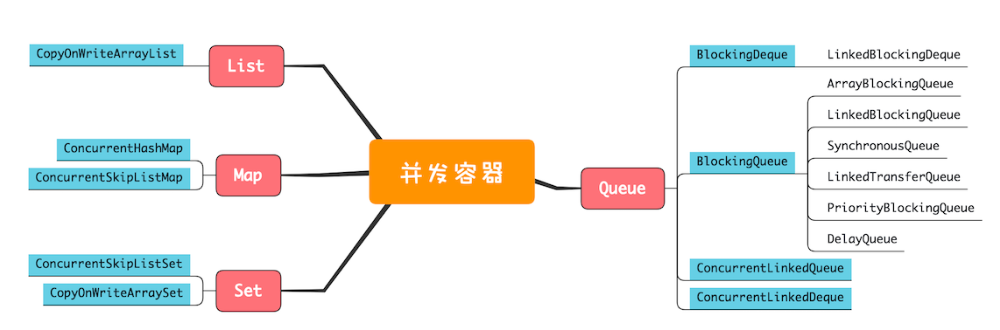

### List
CopyOnWriteArrayList写的时候会将共享变量新复制一份出来，这样做的好处是读操作完全无锁）

* 内部维护了一个数组，成员变量 array 就指向这个内部数组，所有的读操作都是基于 array 进行的，如下图所示，迭代器 Iterator 遍历的就是 array 数组。
     

* 若遍历 array 的同时，新增元素，CopyOnWriteArrayList 会将 array 复制一份，然后在新复制处理的数组上执行增加元素的操作，执行完之后再将 array 指向这个新的数组。读写是可以并行的，遍历操作一直都是基于原 array 执行，而写操作则是基于新 array 进行。
 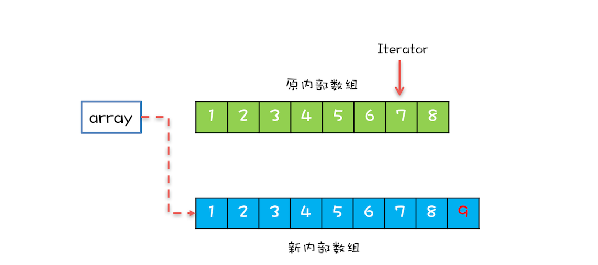

* 总结：
    * 仅适用于写操作非常少的场景，而且能够容忍读写的短暂不一致。例如上面的例子中，写入的新元素并不能立刻被遍历到。
    * 迭代器是只读的，不支持增删改。因为迭代器遍历的仅仅是一个快照而对快照进行增删改是没有意义的。


### Map
ConcurrentHashMap、ConcurrentSkipListMap（SkipList跳表） 区别在于Key是否有序

### Set 
CopyOnWriteArraySet、ConcurrentSkipListSet

### Queue
* 单端阻塞队列
    * 可有界
        * ArrayBlockingQueue（数组）
        * LinkedBlockingQueue（链表）默认大小为Integer最大值
    * 无界
        * SynchronousQueue（无队列，Producer的入队必须等待Consumer的出队）
        * LinkedTransferQueue（融合LinkedBlockingQueue和SynchronousQueue，性能优于LinkedBlockingQueue）
        * PriorityBlockingQueue（支持按照优先级出队）
        * DelayQueue（延时队列）

    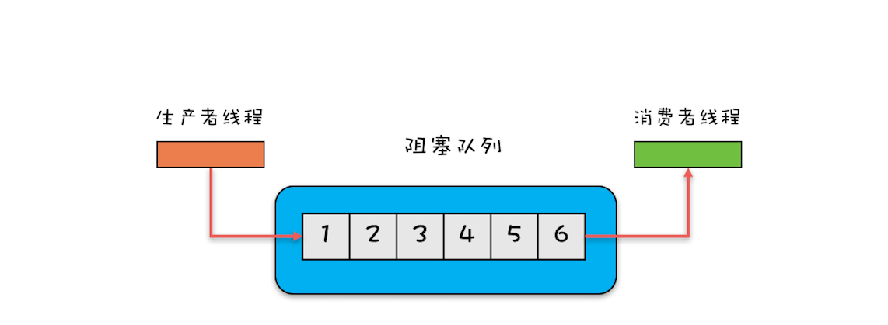

* 双端阻塞队列
    * LinkedBlockingDeque
    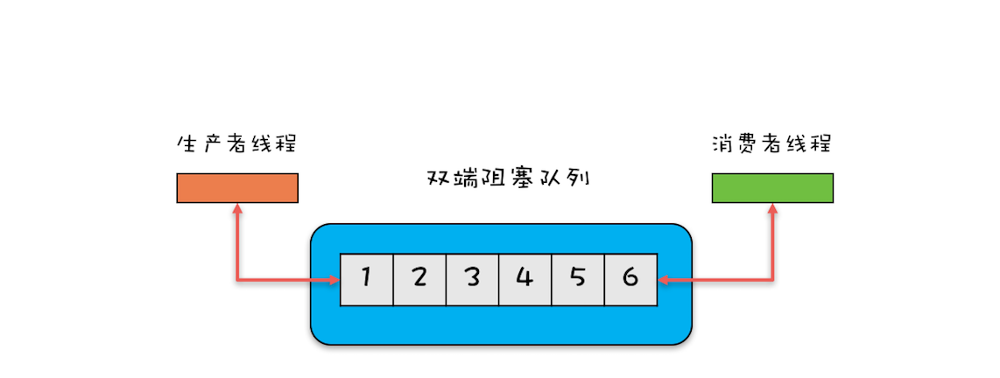

* 单端非阻塞队列
    * ConcurrentLinkedQueue
* 双端非阻塞队列
    * ConcurrentLinkedDeque


-------
# 11. 原子类

* 无锁方案实现原理（Compare And Swap）
    * [代码示例](https://github.com/Fadezed/concurrency/blob/master/src/main/java/com/example/concurrency/features/atomic/SimulatedCompareAndSwap.java)
* 概览图
    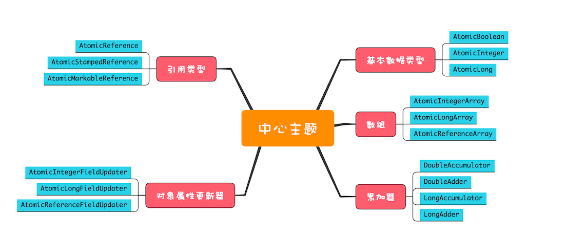

## 原子化的基本数据类型
* AtomicBoolean
* AtomicInteger
* AtomicLong

```
getAndIncrement() // 原子化 i++
getAndDecrement() // 原子化的 i--
incrementAndGet() // 原子化的 ++i
decrementAndGet() // 原子化的 --i
// 当前值 +=delta，返回 += 前的值
getAndAdd(delta) 
// 当前值 +=delta，返回 += 后的值
addAndGet(delta)
//CAS 操作，返回是否成功
compareAndSet(expect, update)
// 以下四个方法
// 新值可以通过传入 func 函数来计算
getAndUpdate(func)
updateAndGet(func)
getAndAccumulate(x,func)
accumulateAndGet(x,func)

```

## 原子化的对象引用类型
* AtomicReference
* AtomicStampedReference（版本号解决ABA问题）
* AtomicMarkableReference（版本号解决ABA问题）

## 原子化数组（比基本类型多了数组的索引参数）
* AtomicIntegerArray
* AtomicLongArray
* AtomicReferenceArray

## 原子化对象属性更新器（基于反射原子化更新对象属性，对象属性必须是volitale保证可见性）
* AtomicIntegerFieldUpdater
* AtomicLongFieldUpdater
* AtomicReferenceFieldUpdater

## 原子化累加器（空间换时间,只支持累加操作性能比原子化基本数据类型更好，不支持compareAndSet()）
* DoubleAccumulator
* DoubleAdder
* LongAccumulator
* LongAdder

-------

# 12. 线程池

## 为什么要用线程池
* 创建对象，仅仅是在 JVM 的堆里分配一块内存而已；
* 而创建一个线程，却需要调用操作系统内核的 API，然后操作系统要为线程分配一系列的资源，这个成本就很高了。

## 线程池是一种生产者-消费者模式（非一般意义池化资源）
* [代码示例](https://github.com/Fadezed/concurrency/blob/master/src/main/java/com/example/concurrency/features/threadPool/MyThreadPool.java)
* Java ThreadPoolExecutor
  
```
ThreadPoolExecutor(
  int corePoolSize,
  int maximumPoolSize,
  long keepAliveTime,
  TimeUnit unit,
  BlockingQueue<Runnable> workQueue,
  ThreadFactory threadFactory,
  RejectedExecutionHandler handler) 

```
* 参数意义 
    * **corePoolSize**:最小或核心线程数。有些项目很闲，但是也不能把人都撤了，至少要留 corePoolSize 个人坚守阵地。
    * **maximumPoolSize**: 最大线程数。当项目很忙时，就需要加人，但是也不能无限制地加，最多就加到 maximumPoolSize 个人。当项目闲下来时，就要撤人了，最多能撤到 corePoolSize 个人。
    * **keepAliveTime & unit**:线程空闲回收时间，大小和单位，也就是说，如果一个线程空闲了keepAliveTime & unit这么久，而且线程池的线程数大于 corePoolSize ，就回收。
    * **workQueue**:工作队列。
    * **threadFactory**:通过这个参数你可以自定义如何创建线程，例如你可以给线程指定一个有意义的名字。
    * **handler**: 拒绝策略。若线程池内所有线程都是忙碌，并且工作队列（有界队列）也满，线程池就会触发拒绝策略，以下为ThreadPoolExecutor提供的四种策略
        * CallerRunsPolicy：提交任务的线程自己去执行该任务。
        * AbortPolicy：默认的拒绝策略，会 throws RejectedExecutionException
        * DiscardPolicy：直接丢弃任务，没有任何异常抛出。
        * DiscardOldestPolicy：丢弃最老的任务，其实就是把最早进入工作队列的任务丢弃，然后把新任务加入到工作队列。
* jdk 1.6之后加入allowCoreThreadTimeOut(boolean value) 核心线程也可释放。

## 注意事项
* 不建议使用Executors创建线程池（很多都是无界队列）
* 慎用默认拒绝策略RejectedExecutionException不强制处理容易忽略，建议自定义拒绝策略配合策略降级使用
* 异常处理不会通知所有需要按需捕获处理异常


-------
# 13. Future
## 获得任务执行结果
* ThreadPoolExecutor提供了三个submit方法


* Future<?> submit(Runnable task);// 提交 Runnable 任务
```
这个方法的参数是一个 Runnable 接口，Runnable 接口的 run() 方法是没有返回值的，所以 submit(Runnable task) 这个方法返回的 Future 仅可以用来断言任务已经结束了，类似于 Thread.join()。
```

* <T> Future <T> submit(Callable <T> task);// 提交 Callable 任务
```
Callable只有一个 call() 方法，并且这个方法是有返回值的，所以这个方法返回的 Future 对象可以通过调用其 get() 方法来获取任务的执行结果。
```
* <T> Future <T> submit(Runnable task, T result);// 提交 Runnable 任务及结果引用  
```
假设这个方法返回的 Future 对象是 f，f.get()=的返回值就是传给 submit() 方法的参数 result。
```


* Future接口提供的方法

```
// 取消任务
boolean cancel(boolean mayInterruptIfRunning);
// 判断任务是否已取消  
boolean isCancelled();
// 判断任务是否已结束
boolean isDone();
// 获得任务执行结果
get();
// 获得任务执行结果，支持超时
get(long timeout, TimeUnit unit);

```


## FutureTask工具类（实现了RunnableFuture而它继承了Runnable和Future接口）
* [代码示例](https://github.com/Fadezed/concurrency/blob/master/src/main/java/com/example/concurrency/features/futuretask/FutureTaskEx.java)
* 构造函数类似线程池submit

```
FutureTask(Callable<V> callable);
FutureTask(Runnable runnable, V result);

```
